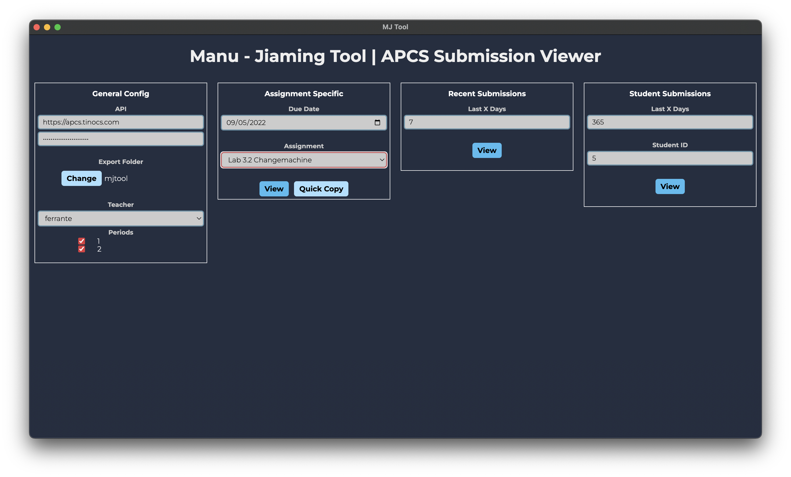
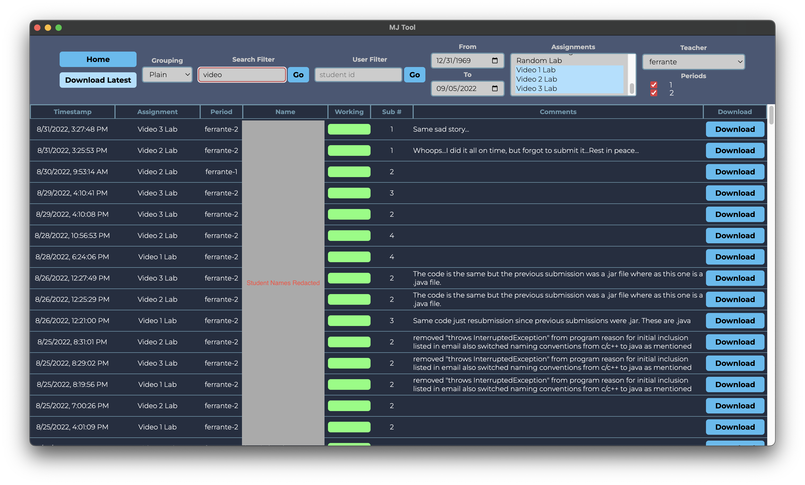

A react/typescript/electron desktop application created for viewing and downloading submissions to the Cupertino High School APCS website (https://apcs.tinocs.com).

This repository is not actively maintained, and only shows the commits that I (Manu) made myself. For an updated version, please visit the repo owned by Mr. McLeod and Mr. Ferrante (you may need to contact them to obtain access).

# Landing
The landing page allows you to set up the general configuration, as well as serve as the entry point to any of the quick filters (the three columns on the right). 

# Plain
Plain view shows submissions by their date submitted, reversed. It's useful for seeing recent submissions of everyone, or of a particular student.

# Ordered
Ordered view is nice for grouping submissions by class period and the assignment it was meant for. An image has not been provided as it would likely violate the students' privacy. 

# Installation
- See bottom of page for building and running source code
- Latest releases also available on right hand side under "Releases column"

Download Links
- mac: https://github.com/enigmurl/mjtool/releases/download/v1.0.0/mjtool.mac.zip
- windows: https://github.com/enigmurl/mjtool/releases/download/v1.0.0/mjtool.windows.zip

For mac, unzip the download and simply open the "mjtool.app" file
For windows, unzip the download and navigate to the "mjtool.exe" file and run it. This is likely under the "mjtool-win32-x64" folder.

**You may be warned that the app is unrecognized, run it anyways**

# Initial Configuration
The following steps pertain to the general config, available on the left hand of the screen.
- Fill in the API fields with appropriate values. For the url, ensure that there is no trailing "/" 
- Select an export folder
- Select a teacher, and then periods you want to view. You can select multiple

# Per Lab Configuration
Simply use one of the three designated viewing templates to query submissions. 
- Assignment specific is the most common, which previews submissions for a single assignment, and adds a due date field for marking submissions as late
    - Use quick copy to copy spreadsheet data without having to visually load everything. It may still take a few seconds.
- Recent submissions is useful for looking at resubmits and related items.
- Student view allows you to see the most recent submissions for a given student (identified by their FUHSD ID)
- You can also play around with the filters at the top of the main page for more complex queries!
- **Important:** Download latest only downloads the latest version of any user (i.e. if a user submits two versions of an assignment that matches the specified filter, only version 2 will be downloaded). This helps prevents extraneous files from showing up. You are free to manually download version 1, of course.

# Potential Improvements 
- General search feature. The problem comes that a lot of the storage on the database is disconnected, the general search means filtering in a lot of different places in the app. From a technical standpoint, it involves a second round of filtering after the categorization step, which builds the state tree. the other filters, however, work before the categorization step, either on the database itself or on the client which filters assignments when there's more than 1. This is rather ugly, and ideally all of it would happen on the server to be perfectly honest.
- Make the app a full on grading tool, where the grading can be done on the app itself (and then the scores are available on the website). Jiaming and I ruled against this on the principle that it would be a significant amount of work (likely meaning I wouldn’t be able to finish before college, which is my soft deadline). Moreover, Google Sheets has the functionality of instant updates. While we have some solutions (i.e. claiming submissions in a locking mechanism), they’re all generally inferior.
- Include direct auto grader support. This is possible, but a bit tricky. It would likely involve having to call a Java subprocess. For now, we ruled that just having autograders in IntelliJ or Eclipse should be efficient enough
- Pagination (essentially all possible metadata results are loaded at once, rather than being lazy loaded). Probably shouldn’t matter too much in this particular case, since the user likely looks at every single metadata instance anyways.
- Another optimization is solving the problem of the client currently sending redundant API calls. Cacheing could be an easy fix, but is not a good solution. A lot of the redundancy comes from researching even on intermediate states (i.e. when you're typing a student id, and are only halfway there).

# Potential Bugs
- Error handling in some situations can be confusing. However, once initial configuration is done properly, this should not be a real problem.

# Source Running
- Download npm (https://nodejs.org/en/)
- clone this repository `git clone https://github.com/enigmurl/mjtool.git`
- using terminal, navigate to the root folder
- install yarn `npm install --global yarn`
- install mjtool dependencies `yarn upgrade`
- run mjtool `yarn start`
- Pull changes with `git pull && yarn upgrade`
- If a yarn start doesn't work after pulling, try deleting the .webpack directory

# Source Building
- Follow Source Running steps, and also run `yarn make`
